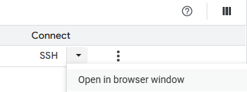

# Hosting Flowise on Google Cloud for Free
### Phase 1: GCP Infrastructure Setup

First, we'll prepare the cloud infrastructure: a static IP, the virtual machine, and all necessary firewall rules.

#### 1\. Reserve a Static IP Address

1.  In the GCP Console, go to **VPC network \> IP addresses**.
2.  Click **RESERVE EXTERNAL STATIC ADDRESS**.
3.  Give it a **Name** (e.g., `flowise-static-ip`).
4.  Choose a **Region** for your VM. It must be a free-tier region: `us-west1` (Oregon), `us-central1` (Iowa), or `us-east1` (South Carolina).
5.  Click **RESERVE**.

#### 2\. Create the VM Instance (as `e2-micro`)

1.  Go to **Compute Engine \> VM instances** and click **CREATE INSTANCE**.
2.  **Name**: Give it a name like `flowise-vm`.
3.  **Region**: Select the **same region** where you reserved your static IP.
4.  **Machine type**: Start with **e2-micro**.
5.  **Boot disk**: Click **Change**. Set the **Operating system** to **Debian** (Version 11 or newer) and the **Size** to **30** GB.
6.  **Networking**:
      * Click on the **Networking** tab.
      * Under **Network tags**, add a tag: `flowise-stack`.
      * Under **Network interfaces**, find the **External IPv4 address** dropdown and select the static IP you reserved (`flowise-static-ip`).
7.  Click **Create**.

#### 3\. Create All Firewall Rules

Go to **VPC network \> Firewall** and click **CREATE FIREWALL RULE** three times to create the following three rules.

**Rule \#1: Allow HTTPS Traffic (Inbound)**

  * **Name**: `allow-https-in`
  * **Direction of traffic**: **Ingress**
  * **Targets**: "Specified target tags" -\> `flowise-stack`
  * **Source IPv4 ranges**: `0.0.0.0/0`
  * **Protocols and ports**: Check **TCP** and enter `443`.
  * Click **Create**.

**Rule \#2: Allow HTTP Traffic (Inbound)**

  * **Name**: `allow-http-in`
  * **Direction of traffic**: **Ingress**
  * **Targets**: "Specified target tags" -\> `flowise-stack`
  * **Source IPv4 ranges**: `0.0.0.0/0`
  * **Protocols and ports**: Check **TCP** and enter `80`.
  * Click **Create**.

**Rule \#3: Allow DNS Lookups (Outbound)**

  * **Name**: `allow-dns-out`
  * **Direction of traffic**: **Egress**
  * **Priority**: `900`
  * **Targets**: "Specified target tags" -\> `flowise-stack`
  * **Destination IPv4 ranges**: `0.0.0.0/0`
  * **Protocols and ports**: Select **TCP and UDP**, then enter `53` in the port box.
  * Click **Create**.

-----

### Phase 2: Domain & Initial VM Setup

1.  **Configure DuckDNS**:
      * Go to the [DuckDNS website](https://www.duckdns.org/) and log in.
      * Create your desired **subdomain**.
      * Manually update the **current ip** field on the DuckDNS site to be your new **Static IP address** from GCP.
      * Copy your **token**.
2.  **Connect to your VM** using the **SSH** button in the GCP Console.

    

3.  **Install Docker**:
    ```bash
    sudo apt-get update
    sudo apt-get install -y docker.io
    ```
4.  **Add your user to the Docker group**:
    ```bash
    sudo usermod -aG docker $USER
    ```
5.  **IMPORTANT**: **Log out** of the SSH session and **log back in** to apply the permissions. By close SSH terminal and opening it again.
6.  **Create Caddy Configuration Files**:
    ```bash
    # Create a directory for Caddy and enter it
    mkdir ~/caddy
    cd ~/caddy

    # Create the Caddyfile
    nano Caddyfile
    ```
      * Paste this into the `Caddyfile`, **replacing the placeholders** with your details:
        ```
        your-subdomain.duckdns.org {
            tls {
                dns duckdns YOUR_DUCKDNS_TOKEN
            }
            reverse_proxy flowise:3000
        }
        ```
      * Save and exit (`Ctrl+X`, `Y`, `Enter`).
      * Now create the `Dockerfile`:
        ```bash
        nano Dockerfile
        ```
      * Paste this exact content into the `Dockerfile`:
        ```dockerfile
        FROM caddy:2-builder AS builder

        RUN xcaddy build \
            --with github.com/caddy-dns/duckdns

        FROM caddy:2

        COPY --from=builder /usr/bin/caddy /usr/bin/caddy
        ```
      * Save and exit.

-----

### Phase 3: The Build Phase (Temporary VM Upgrade)

Now we'll power up the VM just for the resource-intensive build step.

1.  **Stop the VM**: In the GCP Console (**Compute Engine \> VM instances**), click the three-dot menu (⋮) next to your VM and select **Stop**.
2.  **Edit the VM**: Once stopped, click on the VM's name, then click **EDIT**. In the **Machine configuration** section, change the machine type from `e2-micro` to **`e2-medium`**. Save the changes.
3.  **Start the VM** and **SSH back in**.
4.  **Build the Caddy Image**: Navigate to your Caddy directory and run the build command. It will now be much faster.
    ```bash
    cd ~/caddy
    docker build -t caddy-custom .
    ```

-----

### Phase 4: Return to Free Tier & Deploy

With the build complete, we'll switch back to the free tier and launch the applications.

1.  **Stop the VM** from the GCP console again.
2.  **Edit the VM** and change the machine type **back to `e2-micro`**. Save the changes. This is critical for staying on the free tier.
3.  **Start the VM** and **SSH back in**.
4.  **Create a Docker Network**:
    ```bash
    docker network create flowise-net
    ```
5.  **Run the ChromaDB Container**:
    ```bash
    docker run -d --name chroma --network flowise-net --restart unless-stopped -v ~/chroma_data:/chroma/chroma -p 8000:8000 chromadb/chroma
    ```
6.  **Run the Flowise Container**:
    ```bash
    docker run -d --name flowise --network flowise-net --restart unless-stopped -v ~/flowise_data:/root/.flowise -e CHROMA_URL="http://chroma:8000" flowiseai/flowise
    ```
7.  **Run the Caddy Container**:
    ```bash
    docker run -d -p 80:80 -p 443:443 --name caddy --network flowise-net --restart unless-stopped -v ~/caddy/Caddyfile:/etc/caddy/Caddyfile caddy-custom
    ```

-----

### Phase 5: Verification

You are all done\! After about a minute, your entire stack should be up and running securely.

  * **Access your site** at: `https://your-subdomain.duckdns.org`
  * **Check the status** by running `docker ps`. You should see three containers running: `flowise`, `caddy`, and `chroma`.
  * **Test the integration** by creating a chatflow in Flowise that uses a Chroma vector store node. ✅

-----

Last Updated: 30 July 2025