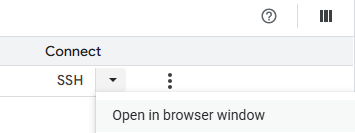

# Hosting n8n on Google Cloud for Free
### 1\. Set Up Your GCP VM ☁️

First, you'll need to create a new virtual machine instance on GCP. The **e2-micro** instance is a good choice as it falls within the free tier.

  * **Create a new project** in the Google Cloud Console.
  * Enable the **Compute Engine API**.
  * Configure your VM with the following settings:
      * **Machine type**: `e2-micro`
      * **Boot disk**: Ubuntu (latest version)
      * **Firewall**: Allow HTTP and HTTPS traffic.

-----

### 2\. Reserve a Static IP Address 📍

Next, reserve a static IP address for your VM. This ensures that the IP address of your VM doesn't change, which is crucial for a reliable connection with your domain.

  * In the GCP Console, navigate to **VPC network** -\> **IP addresses**.
  * Click on **Reserve a static address**.
  * Choose a name for your static IP and select the region where your VM is located.
  * Assign the static IP to your newly created VM instance.

-----

### 3\. Set Up Duck DNS 🦆

Now, you'll use Duck DNS to point a custom domain to your VM's static IP address.

  * Go to the **Duck DNS website** and sign in.
  * In the "add domain" section, choose a subdomain (e.g., `your-n8n-instance`). Your full domain will be `your-n8n-instance.duckdns.org`.
  * In the "current ip" field, enter the **static IP address** you reserved in the previous step.
  * Click **"add domain"**.

-----

### 4\. Prepare Your Server 🛠️

Now, you'll need to connect to your VM via SSH and install the necessary software.

  * **Connect to your VM** using the SSH button in the GCP Console.
 
    
 
  * **Install Docker and Docker Compose** by running the following commands in the terminal:
    ```bash
    sudo apt-get update
    sudo apt-get install docker.io
    sudo systemctl start docker
    sudo systemctl enable docker
    sudo curl -L "https://github.com/docker/compose/releases/download/1.29.2/docker-compose-$(uname -s)-$(uname -m)" -o /usr/local/bin/docker-compose
    sudo chmod +x /usr/local/bin/docker-compose
    ```
  * **Install Nano**, a simple text editor:
    ```bash
    sudo apt-get install nano
    ```

-----

### 5\. Install and Configure n8n 🚀

Finally, you'll create the necessary configuration files and launch your n8n instance.

  * Create a `.env` file to store your environment variables:
    ```bash
    nano .env
    ```
    Add the following lines to the file, replacing the placeholder values with your own:
    ```
    DATA_FOLDER=./n8n-data
    DOMAIN_NAME=your-n8n-instance.duckdns.org
    SUBDOMAIN=n8n
    SSL_EMAIL=your-email@example.com
    ```
  * Create a `docker-compose.yml` file:
    ```bash
    nano docker-compose.yml
    ```
    Paste the following code into the file:
    ```yaml
    version: '3'

    services:
      traefik:
        image: "traefik:v2.5"
        container_name: "traefik"
        command:
          - "--api.insecure=true"
          - "--providers.docker=true"
          - "--providers.docker.exposedbydefault=false"
          - "--entrypoints.web.address=:80"
          - "--entrypoints.websecure.address=:443"
          - "--certificatesresolvers.myresolver.acme.tlschallenge=true"
          - "--certificatesresolvers.myresolver.acme.email=${SSL_EMAIL}"
          - "--certificatesresolvers.myresolver.acme.storage=/letsencrypt/acme.json"
        ports:
          - "80:80"
          - "443:443"
          - "8080:8080"
        volumes:
          - "./letsencrypt:/letsencrypt"
          - "/var/run/docker.sock:/var/run/docker.sock:ro"

      n8n:
        image: n8nio/n8n
        container_name: "n8n"
        restart: always
        ports:
          - "5678:5678"
        labels:
          - "traefik.enable=true"
          - "traefik.http.routers.n8n.rule=Host(`${SUBDOMAIN}.${DOMAIN_NAME}`)"
          - "traefik.http.routers.n8n.entrypoints=websecure"
          - "traefik.http.routers.n8n.tls.certresolver=myresolver"
          - "traefik.http.middlewares.n8n.headers.SSLRedirect=true"
          - "traefik.http.middlewares.n8n.headers.STSSeconds=315360000"
          - "traefik.http.middlewares.n8n.headers.browserXSSFilter=true"
          - "traefik.http.middlewares.n8n.headers.contentTypeNosniff=true"
          - "traefik.http.middlewares.n8n.headers.forceSTSHeader=true"
          - "traefik.http.middlewares.n8n.headers.SSLHost=${DOMAIN_NAME}"
          - "traefik.http.middlewares.n8n.headers.STSIncludeSubdomains=true"
          - "traefik.http.middlewares.n8n.headers.STSPreload=true"
        environment:
          - N8N_HOST=${SUBDOMAIN}.${DOMAIN_NAME}
          - N8N_PORT=5678
          - N8N_PROTOCOL=https
          - NODE_ENV=production
          - WEBHOOK_URL=https://${SUBDOMAIN}.${DOMAIN_NAME}/
        volumes:
          - ${DATA_FOLDER}:/root/.n8n

    volumes:
      n8n-data:
    ```
  * **Launch n8n** using Docker Compose:
    ```bash
    sudo docker-compose up -d
    ```

Your n8n instance should now be accessible at `https://n8n.your-n8n-instance.duckdns.org`. You can now set up your owner account and start building workflows\!
-----
### 6\. Credits

[Inspired by this post by Ai Agency+](https://aiagencyplus.com/self-host-n8n-free-google-cloud-docker-compose/) with Gemini's help.

-----
Last Updated: 30 July 2025